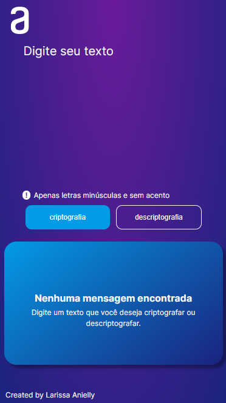

# Codificador 
 

# Sobre o projeto

https://larissa-anielly.github.io/Codificador/

Desafio ONE: Iniciante em programação | Parceria de Alura + Oracle

## Layout web

# Tecnologias utilizadas

## Front end
- HTML / CSS / JS 

# Autor

Larissa Anielly Freitas Moura

