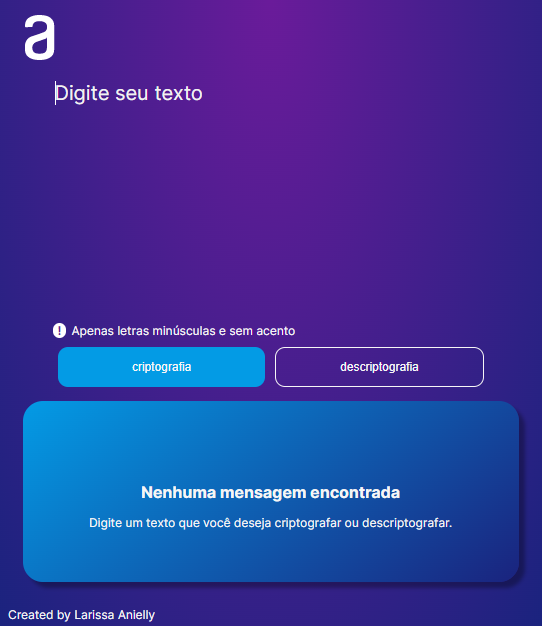

# Decodificador 
 

# Sobre o projeto

https://larissa-anielly.github.io/Decodificador/

Desafio ONE: Iniciante em programação | Parceria de Alura + Oracle

Esse desafio tem como objetivo testar o conhecimento adiquirido durante o curso.

## Layout web

# Tecnologias utilizadas

## Front end
- HTML / CSS / JS 

# Autor

Larissa Anielly Freitas Moura

